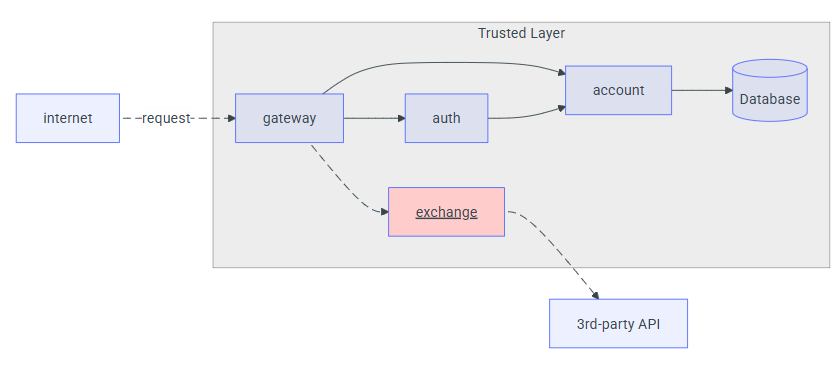

# Exchange API

## Overview
A **Exchange API** é um microsserviço desenvolvido em Python com **FastAPI** que permite converter valores entre duas moedas qualquer, utilizando uma fonte externa de taxas de câmbio (no caso, a **AwesomeAPI**). O serviço expõe um único endpoint HTTP `GET /exchange/{from_currency}/{to_currency}`, que recebe os códigos das moedas de origem e destino, consulta a API externa, e retorna o valor de venda, o valor de compra, a data/hora da última cotação e o `id-account` do usuário (injetado via header).


---

## Tecnologias e Dependências
- **Linguagem:** Python 3.8+  
- **Framework Web:** FastAPI  
- **Cliente HTTP:** requests  
- **Servidor ASGI (desenvolvimento):** Uvicorn  
- **Fonte de taxas de câmbio:** AwesomeAPI (padrão)  
- **Variáveis de ambiente (opcionais):**  
  - `EXTERNAL_API_URL` (URL base da API de câmbio; default: `https://economia.awesomeapi.com.br/last`)  
  - `PORT` (porta para execução via Uvicorn; default: 8000)  

### Principais Dependências (requirements.txt)
```
txt
fastapi
uvicorn
requests
```


## Descrição do Endpoint

```
http GET /exchange/{from_currency}/{to_currency}
```

* **Parâmetros de caminho (path parameters):**

  * `from_currency` (string): Código da moeda de origem (por exemplo, `USD`, `EUR`, `BRL`).
  * `to_currency` (string): Código da moeda de destino (por exemplo, `BRL`, `USD`).

* **Headers obrigatórios:**

  * `id-account` (string): Identificador da conta/usuário que faz a requisição. Caso não seja enviado, a API retorna **HTTP 401 Unauthorized**:

    ```json
    {
      "detail": "Missing id-account header"
    }
    ```

* **Resposta de Sucesso (HTTP 200):**

  ```json
  {
    "sell": 0.82,
    "buy": 0.80,
    "date": "2021-09-01 14:23:42",
    "id-account": "0195ae95-5be7-7dd3-b35d-7a7d87c404fb"
  }
  ```

  * `sell` (float): Taxa de venda (ask) da moeda de destino em relação à moeda de origem.
  * `buy` (float): Taxa de compra (bid) da moeda de destino em relação à moeda de origem.
  * `date` (string): Timestamp da última cotação (formato `YYYY-MM-DD HH:MM:SS`).
  * `id-account` (string): Mesmo valor enviado no header, para rastreabilidade.

* **Possíveis Códigos de Erro:**

  * **401 Unauthorized**: Header `id-account` ausente.
  * **503 Service Unavailable**: Falha ao consultar a API externa (AwesomeAPI) ou timeout.

    ```json
    {
      "detail": "Erro ao consultar a API externa de câmbio."
    }
    ```

---

## Fluxo de Funcionamento

1. O cliente envia uma requisição `GET /exchange/{from_currency}/{to_currency}` incluindo o header `id-account`, por exemplo:

   ```
   GET /exchange/USD/BRL
   Headers:
     id-account: 0195ae95-5be7-7dd3-b35d-7a7d87c404fb
   ```

2. A aplicação FastAPI faz validação:

   * Se o header `id-account` não estiver presente, retorna **401 Unauthorized**.
   * Constrói a *currency pair* em formato `{FROM}-{TO}` (por exemplo, `USD-BRL`).

3. Conecta na API externa **AwesomeAPI** (ou outra configurada via `EXTERNAL_API_URL`):

   ```
   GET https://economia.awesomeapi.com.br/last/USD-BRL
   ```

4. Se a chamada à API externa for bem-sucedida:

   * Extrai o objeto JSON retornado, que contém as chaves `ask`, `bid` e `timestamp` para a pair `"USDBRL"`.
   * Converte `ask` e `bid` para `float`.
   * Transforma o `timestamp` (unidade: segundos) em data/hora no formato `YYYY-MM-DD HH:MM:SS`.
   * Retorna JSON com `sell`, `buy`, `date` e repassa o `id-account`.

5. Se ocorrer qualquer erro (timeout, par inexistente, resposta inválida), retorna **503 Service Unavailable**.

---

## Estrutura do Código (`main.py`)

```python
import os
from datetime import datetime

import requests
from fastapi import FastAPI, Request, HTTPException

app = FastAPI(
    title="Exchange API",
    version="1.0.0",
    description="Converte valores entre duas moedas usando uma fonte externa (AwesomeAPI)."
)

# URL da API de câmbio externa
EXTERNAL_API_URL = os.getenv("EXTERNAL_API_URL", "https://economia.awesomeapi.com.br/last")


@app.get("/exchange/{from_currency}/{to_currency}")
def convert_currency(from_currency: str, to_currency: str, request: Request):
    # Verifica se o header com o ID da conta está presente (injetado pelo gateway)
    account_id = request.headers.get("id-account")
    if not account_id:
        raise HTTPException(status_code=401, detail="Missing id-account header")

    # Ex: USD-BRL
    pair = f"{from_currency.upper()}-{to_currency.upper()}"

    try:
        response = requests.get(f"{EXTERNAL_API_URL}/{pair}", timeout=5)
        response.raise_for_status()
        data = response.json()
        key = f"{from_currency.upper()}{to_currency.upper()}"
        quote = data[key]
    except Exception as exc:
        raise HTTPException(
            status_code=503,
            detail="Erro ao consultar a API externa de câmbio."
        ) from exc

    return {
        "sell": float(quote["ask"]),
        "buy": float(quote["bid"]),
        "date": datetime.fromtimestamp(int(quote["timestamp"])).strftime("%Y-%m-%d %H:%M:%S"),
        "id-account": account_id
    }


if __name__ == "__main__":
    import uvicorn
    port = int(os.getenv("PORT", "8000")) 
    uvicorn.run("main:app", host="0.0.0.0", port=port, reload=True)

```

### Detalhes Importantes

* **Framework FastAPI:**

  * Cria automaticamente documentação interativa (Swagger UI) em `/docs` e Redoc em `/redoc`.
  * Valida tipos de parâmetros e retorna erros 422 caso os formats estejam incorretos.
* **Validação de Header:**

  * A `id-account` deve ser injetada pelo serviço de API Gateway antes de encaminhar a requisição a este microsserviço.
  * Sem esse header, a requisição é negada – garantindo rastreabilidade da conta solicitante.
* **Chave de Consulta (`key`) no JSON Externo:**

  * A AwesomeAPI devolve um JSON onde a chave principal é a concatenação das moedas: `"USDBRL": { "ask": "...", "bid": "...", ... }`.
  * Por isso, é importante normalizar as strings para **MAIÚSCULAS**.
* **Tratamento de Erros:**

  * Se o par de moedas for inválido, se a API externa estiver fora do ar ou retornar erro 4xx/5xx, a rota retorna **503 Service Unavailable** com mensagem genérica.
* **Formato de Data:**

  * A `timestamp` retornada pela API externa vem em segundos desde 1970. Convertida para `YYYY-MM-DD HH:MM:SS` para legibilidade.

---

## Variáveis de Ambiente

* `EXTERNAL_API_URL` (opcional)
  URL base da fonte de taxas de câmbio.

  * **Default:** `https://economia.awesomeapi.com.br/last`
  * Exemplo para outra API:

    ```bash
    export EXTERNAL_API_URL="https://api.exchangerate-api.com/v4/latest"
    ```

* `PORT` (opcional)
  Porta TCP em que o Uvicorn irá expor o serviço.

  * **Default:** `8000`

---

## Como Executar Localmente

1. **Clonar o repositório**:

   ```bash
   git clone <URL-do-repositório>
   cd exchange-service
   ```

2. **Criar e ativar um ambiente virtual (recomendado)**:

   ```bash
   python3 -m venv .venv
   source .venv/bin/activate
   ```

3. **Instalar dependências**:

   ```bash
   pip install fastapi uvicorn requests
   ```

4. **Configurar variáveis de ambiente (opcional)**:

   ```bash
   export EXTERNAL_API_URL="https://economia.awesomeapi.com.br/last"
   export PORT=8000
   ```

5. **Iniciar o servidor**:

   ```bash
   uvicorn main:app --host 0.0.0.0 --port ${PORT:-8000} --reload
   ```

6. **Testar no navegador ou via curl**:

   * Documentação interativa:

     ```
     http://localhost:8000/docs
     ```
   * Exemplo de requisição com `curl`:

     ```bash
     curl -H "id-account: 0195ae95-5be7-7dd3-b35d-7a7d87c404fb" \
          http://localhost:8000/exchange/USD/BRL
     ```

---

## Exemplo de Uso

**Requisição:**

```http
GET /exchange/EUR/GBP HTTP/1.1
Host: localhost:8000
id-account: 0195ae95-5be7-7dd3-b35d-7a7d87c404fb
```

**Resposta (200 OK):**

```json
{
  "sell": 0.8582,
  "buy": 0.8521,
  "date": "2021-09-01 14:23:42",
  "id-account": "0195ae95-5be7-7dd3-b35d-7a7d87c404fb"
}
```

## Diagrama de Fluxo



---

## Considerações Finais

* A **Exchange API** provê um serviço simples, mas essencial, para qualquer sistema de pagamentos, e-commerce ou plataforma financeira que precise de cotações em tempo real.
* É possível estender o código para:

  * Suportar outras APIs de câmbio (basta ajustar `EXTERNAL_API_URL` e tratamento de resposta).
  * Adicionar cache (Redis, in-memory) para reduzir chamadas externas e melhorar performance.
  * Implementar validação de parâmetros (moedas válidas, formatos).
  * Cobrir testes unitários/mocks para chamada à API externa.

Esse documento deve servir como referência para entender o funcionamento interno, configuração e ponto de entrada do microsserviço de câmbio.

