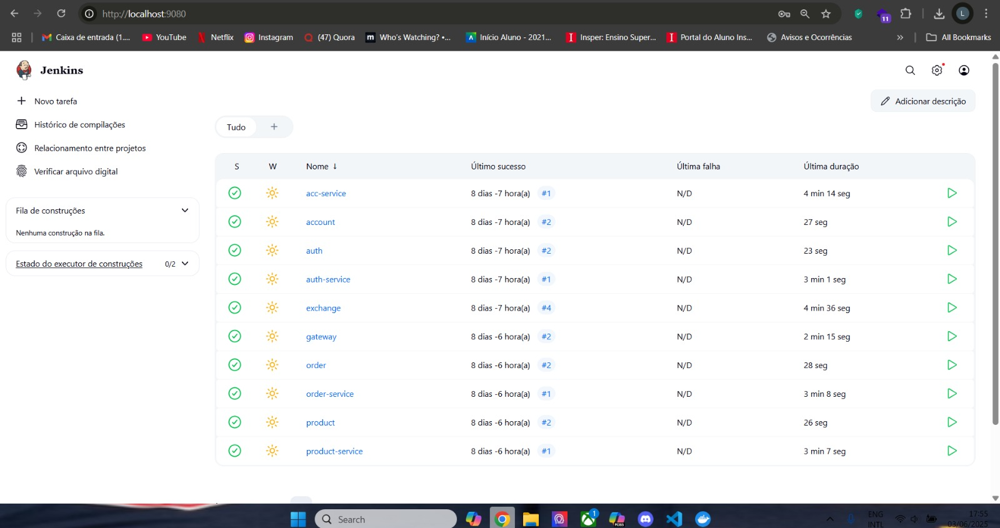

# Automação de Deploy com Jenkins

## Overview

Este módulo aborda a criação de uma pipeline de automação utilizando **Jenkins** para realizar o **build, empacotamento, publicação e deploy** contínuos dos microserviços em um cluster **Kubernetes**.

A ideia é garantir um fluxo padronizado e confiável de **CI/CD** para toda a plataforma.

---

## 🧱 Estrutura do Projeto

Cada microserviço possui um `Jenkinsfile` específico no seu diretório raiz. Além disso, um pipeline principal pode ser utilizado para orquestrar múltiplos serviços em sequência:

```
.
├── account-service/
│   └── Jenkinsfile
├── auth-service/
│   └── Jenkinsfile
├── gateway-service/
│   └── Jenkinsfile
├── product-service/
│   └── Jenkinsfile
├── order-service/
│   └── Jenkinsfile
```

---

## 🔁 Etapas do Pipeline

Cada `Jenkinsfile` deve implementar uma sequência clara de etapas:

1. **Clonagem do Repositório** – Garante acesso ao código atualizado.
2. **Instalação de Dependências** – Prepara o ambiente da aplicação.
3. **Build do Serviço** – Compila e empacota o microserviço.
4. **Build & Push da Imagem** – Constrói a imagem Docker e envia para o Docker Hub.
5. **Deploy no Cluster** – Atualiza o serviço no Kubernetes com a nova imagem.

---

## 📄 Exemplo de Jenkinsfile (`product-service`)

```groovy
pipeline {
    agent any
    environment {
        SERVICE = 'product'
        NAME = "lucafeltrin14/${env.SERVICE}"
    }
    stages {
        stage('Dependencies') {
            steps {
                build job: 'product', wait: true
            }
        }
        stage('Build') {
            steps {
                sh 'mvn -B -DskipTests clean package'
            }
        }
        stage('Build & Push Image') {
            steps {
                withCredentials([usernamePassword(
                    credentialsId: 'dockerhub-credential',
                    usernameVariable: 'USERNAME',
                    passwordVariable: 'TOKEN'
                )]) {
                    sh 'docker login -u $USERNAME -p $TOKEN'
                    sh "docker buildx create --use --platform=linux/arm64,linux/amd64 --node multi-platform-builder-${env.SERVICE} --name multi-platform-builder-${env.SERVICE}"
                    sh "docker buildx build --platform=linux/arm64,linux/amd64 --push --tag ${env.NAME}:latest --tag ${env.NAME}:${env.BUILD_ID} -f Dockerfile ."
                    sh "docker buildx rm --force multi-platform-builder-${env.SERVICE}"
                }
            }
        }
    }
}
```

---

## 🧩 Requisitos

Para que a automação funcione corretamente, certifique-se de que o ambiente Jenkins esteja configurado com:

* Plugins para **Docker**, **Git** e **Kubernetes**.
* Acesso ao cluster Kubernetes (via `kubeconfig`).
* Credenciais do Docker Hub cadastradas (`dockerhub-credential`).
* Scripts `Dockerfile` e `k8s.yaml` versionados no repositório.

---

## 🌐 Deploy Integrado

Todos os serviços devem ser implantados no **mesmo cluster Kubernetes**. O deploy pode ser feito diretamente via comandos `kubectl` ou com integração via scripts dentro do Jenkinsfile.

> Recomenda-se o uso de `docker buildx` para suportar múltiplas arquiteturas (arm64, amd64).

---

## 💡 Dicas & Expansões

* Use `build job: 'service'` para compor pipelines maiores e reutilizar etapas entre microserviços.
* Pode-se estender o pipeline com:

  * Testes automatizados (JUnit, Pytest, etc.)
  * Análise estática de código (SonarQube, ESLint, etc.)
  * Lint e validação de manifests YAML
  * Notificações via Slack ou Discord
* A tag `:latest` e `:${BUILD_ID}` ajuda no rastreamento de versões por imagem.

---

## 🖼 Exemplo Visual

Pipelines dos microserviços podem ser visualizados no Jenkins:



