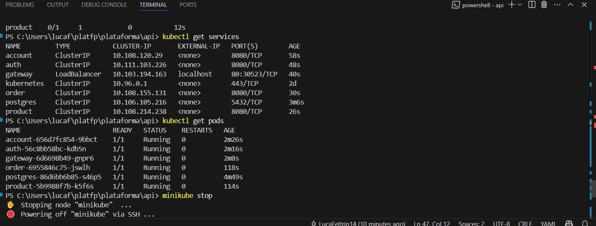

# Setup Local com Kubernetes (Minikube ou Kind)

## Overview

Esta seção descreve como configurar um ambiente local utilizando **Kubernetes** com **Minikube** ou **Kind**, com o objetivo de hospedar todos os microserviços da aplicação em um único **cluster local**.

Cada microserviço deve ser implantado com recursos específicos do Kubernetes, definidos em arquivos `k8s.yaml`. Esses arquivos devem incluir configurações de **Secrets**, **ConfigMaps**, **Deployments** e **Services**, garantindo que cada serviço funcione corretamente dentro do cluster.


---

## ⚙️ Pré-requisitos

Antes de iniciar, verifique se possui:

* ✅ [Minikube](https://minikube.sigs.k8s.io/) ou [Kind](https://kind.sigs.k8s.io/) instalados.
* ✅ Docker instalado e acessível no terminal.
* ✅ Acesso ao terminal com permissões administrativas (root/sudo).
* ✅ Diretório do projeto organizado com arquivos `k8s.yaml` para cada serviço.

> Alternativamente, você pode usar o Kubernetes integrado ao **Docker Desktop** (com suporte habilitado).

---

## 🗂 Estrutura Esperada do Projeto

A estrutura recomendada para organizar os manifests de cada microserviço:

```
api/
├── account-service/
│   └── k8s/
│       └── k8s.yaml
├── auth-service/
│   └── k8s/
│       └── k8s.yaml
├── gateway-service/
│   └── k8s/
│       └── k8s.yaml
├── product-service/
│   └── k8s/
│       └── k8s.yaml
└── order-service/
    └── k8s/
        └── k8s.yaml
```

Cada arquivo `k8s.yaml` pode conter múltiplos recursos definidos sequencialmente.

---

## 📄 Recursos Kubernetes por Serviço

Cada `k8s.yaml` deve incluir obrigatoriamente:

* `Secret`: Armazena tokens, senhas e variáveis sensíveis.
* `ConfigMap`: Define variáveis de ambiente, configurações não sensíveis.
* `Deployment`: Controla o rollout e a gestão dos pods.
* `Service`: Expõe o serviço internamente no cluster (ClusterIP ou NodePort).

> Para ambientes locais, o uso de `NodePort` facilita testes manuais via navegador ou API clients.

---

## 🚀 Comandos Essenciais

### Inicializar o cluster

```bash
minikube start
```

Ou, caso esteja usando o Kind:

```bash
kind create cluster --name my-cluster
```

### Aplicar os manifests de todos os serviços

```bash
kubectl apply -f account-service/k8s/k8s.yaml
kubectl apply -f auth-service/k8s/k8s.yaml
kubectl apply -f gateway-service/k8s/k8s.yaml
kubectl apply -f product-service/k8s/k8s.yaml
kubectl apply -f order-service/k8s/k8s.yaml
```

### Verificar status dos recursos

```bash
kubectl get pods
kubectl get svc
kubectl get deployments
```

---

## ✅ Validação

Para garantir que todos os serviços estão rodando no cluster local:

 Verifique o contexto ativo:

   ```bash
   kubectl config current-context
   ```

 Liste os pods e serviços:

   ```bash
   kubectl get pods
   kubectl get services
   ```

 Verifique se todos os pods estão com `STATUS = Running`.




---

## ☁️ Alternativa: Deploy em Nuvem

Se preferir utilizar um cluster em nuvem, as opções populares são:

* **Amazon EKS**
* **Google Kubernetes Engine (GKE)**
* **Azure Kubernetes Service (AKS)**

Os mesmos `k8s.yaml` utilizados localmente podem ser reaproveitados. É necessário apenas adaptar configurações específicas, como `StorageClass`, `Ingress` e variáveis de ambiente.

---
