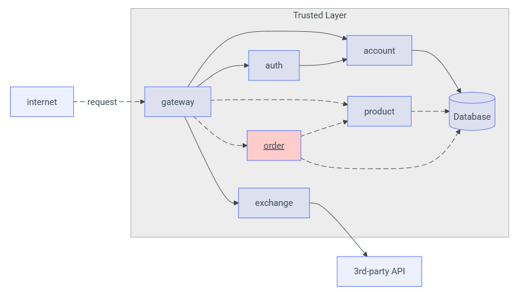

# Order API

## Overview

A **Order API** é responsável por lidar com os pedidos feitos por usuários da plataforma. Ela permite registrar novos pedidos, listar pedidos associados ao usuário autenticado e consultar detalhes de pedidos específicos.

Todas as chamadas são feitas via **API Gateway** e requerem autenticação por **token JWT**.

---

## Endpoints

### `POST /order`

Registra um novo pedido para o usuário atual.

**Corpo da requisição:**

```json
{
  "items": [
    {
      "idProduct": "0195abfb-7074-73a9-9d26-b4b9fbaab0a8",
      "quantity": 2
    },
    {
      "idProduct": "0195abfe-e416-7052-be3b-27cdaf12a984",
      "quantity": 1
    }
  ]
}
```

**Respostas:**

* `201 Created` – Pedido registrado.
* `400 Bad Request` – Erro nos dados enviados.

---

### `GET /order`

Retorna todos os pedidos vinculados ao usuário autenticado.

**Resposta:**

```json
[
  {
    "id": "0195ac33-73e5-7cb3-90ca-7b5e7e549569",
    "date": "2025-09-01T12:30:00",
    "total": 26.44
  },
  {
    "id": "0195ac33-cbbd-7a6e-a15b-b85402cf143f",
    "date": "2025-10-09T03:21:57",
    "total": 18.6
  }
]
```

* `200 OK`

---

### `GET /order/{id}`

Retorna os detalhes de um pedido específico do usuário autenticado.

**Resposta:**

```json
{
  "id": "0195ac33-73e5-7cb3-90ca-7b5e7e549569",
  "date": "2025-09-01T12:30:00",
  "items": [
    {
      "id": "01961b9a-bca2-78c4-9be1-7092b261f217",
      "product": {
        "id": "0195abfb-7074-73a9-9d26-b4b9fbaab0a8"
      },
      "quantity": 2,
      "total": 20.24
    },
    {
      "id": "01961b9b-08fd-76a5-8508-cdb6cd5c27ab",
      "product": {
        "id": "0195abfe-e416-7052-be3b-27cdaf12a984"
      },
      "quantity": 10,
      "total": 6.2
    }
  ],
  "total": 26.44
}
```

* `200 OK` – Pedido retornado com sucesso.
* `404 Not Found` – Pedido não pertence ao usuário ou não foi localizado.

---

## Funcionalidades Extras

A API pode ser complementada com:

* Validações completas de entrada.
* Regras de autorização:

  * `admin`: gerencia produtos.
  * `user`: realiza e consulta pedidos.
* Mensagens de erro claras e contextualizadas.
* Integração com filtros de produto (ex: busca por nome) para facilitar criação de pedidos via interface.

---

## Integração com a Plataforma

### Fluxo de comunicação:

```
Cliente → Gateway → Order API → Banco de Dados
```

### Diagrama de fluxo:


### Serviços envolvidos:

* **API Gateway** – Encaminha requisições e realiza autenticação.
* **Auth Service** – Verifica validade e permissões do token JWT.
* **Order API** – Processa a lógica dos pedidos.
* **Banco de Dados** – Armazena os pedidos e seus itens.
* **Product API** – Verifica a existência e dados dos produtos envolvidos no pedido.

---

## Segurança

* Todas as requisições devem ser feitas por **HTTPS**.
* Token JWT é obrigatório e deve ser enviado no cabeçalho.
* A API valida se o pedido pertence ao usuário autenticado antes de retornar seus dados.

---

