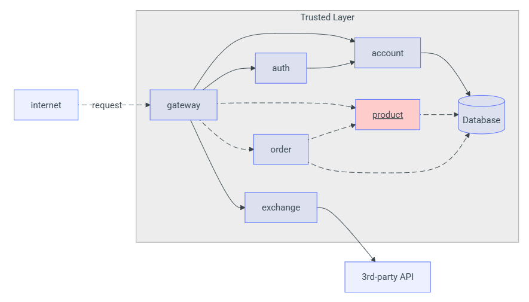

# Product API

## Overview

A **Product API** é um serviço REST que compõe o ecossistema de uma loja virtual. Sua principal função é permitir o gerenciamento de produtos e, de forma integrada, dar suporte ao controle de pedidos. A comunicação com outros serviços da plataforma é feita por meio de um **API Gateway**, garantindo autenticação centralizada com tokens **JWT**.

Todas as requisições devem conter um token JWT válido.

---

## Endpoints de Produto

### `POST /product`

Cria um novo produto na base de dados.

**Requisição:**

```json
{
  "name": "Tomato",
  "price": 10.12,
  "unit": "kg"
}
```

**Respostas possíveis:**

* `201 Created` – Produto cadastrado com sucesso.
* `400 Bad Request` – Erro de validação nos dados fornecidos.

---

### `GET /product`

Retorna a lista de todos os produtos cadastrados.

**Resposta:**

```json
[
  {
    "id": "0195abfb-7074-73a9-9d26-b4b9fbaab0a8",
    "name": "Tomato",
    "price": 10.12,
    "unit": "kg"
  },
  {
    "id": "0195abfe-e416-7052-be3b-27cdaf12a984",
    "name": "Cheese",
    "price": 0.62,
    "unit": "slice"
  }
]
```

* `200 OK`

---

### `GET /product/{id}`

Consulta um produto específico pelo seu ID.

**Resposta:**

```json
{
  "id": "0195abfb-7074-73a9-9d26-b4b9fbaab0a8",
  "name": "Tomato",
  "price": 10.12,
  "unit": "kg"
}
```

* `200 OK` – Produto encontrado.
* `404 Not Found` – Nenhum produto encontrado com esse ID.

---

### `DELETE /product/{id}`

Remove um produto da base de dados utilizando seu ID.

* `204 No Content` – Exclusão bem-sucedida.
* `404 Not Found` – Produto não localizado.

---

## Diagrama de Fluxo




## Funcionalidades Extras

Além das operações básicas, a API pode ser estendida com:

* Filtro de produtos por nome utilizando busca parcial (`like`).
* Controle de acesso por função:

  * `admin`: pode criar, editar e excluir produtos.
  * `user`: tem permissão apenas para registrar pedidos.
* Validação robusta dos dados de entrada.
* Respostas padronizadas para mensagens de erro.

---

## Integração com a Plataforma

### Arquitetura Simplificada

```
Cliente → API Gateway → Product API → Banco de Dados
```

### Serviços Relacionados

* **API Gateway** – Centraliza a entrada e autentica tokens JWT.
* **Auth Service** – Emite e valida tokens de autenticação.
* **Account Service** – Gerencia as informações de usuário.
* **Database** – Armazena os produtos e registros de pedidos.
* **APIs externas** – (opcional) para sincronização com catálogos de terceiros.

---

## Segurança

A Product API adota boas práticas de segurança:

* Suporte obrigatório a **HTTPS**.
* Autenticação via **JWT** em todas as requisições.
* Controle de permissões baseado em **nível de acesso** (admin/user).

---

